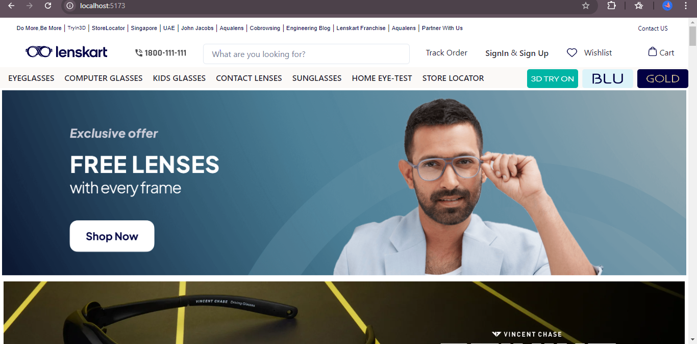
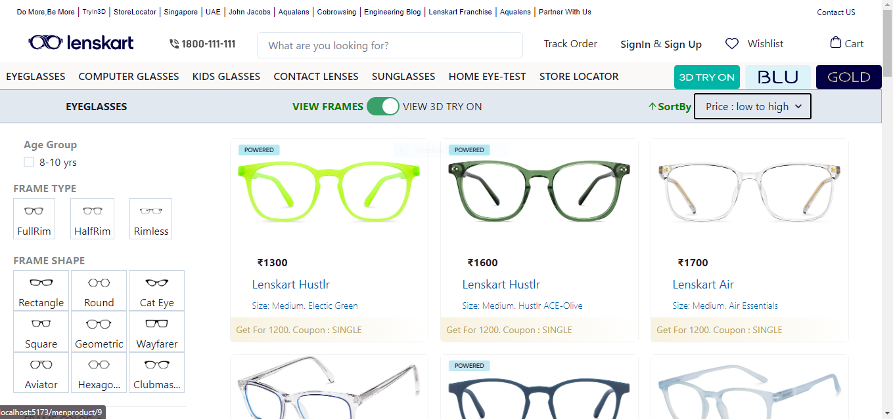
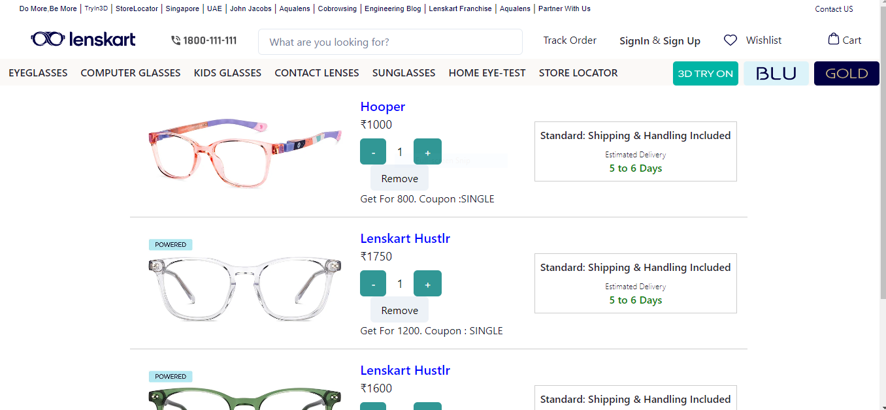
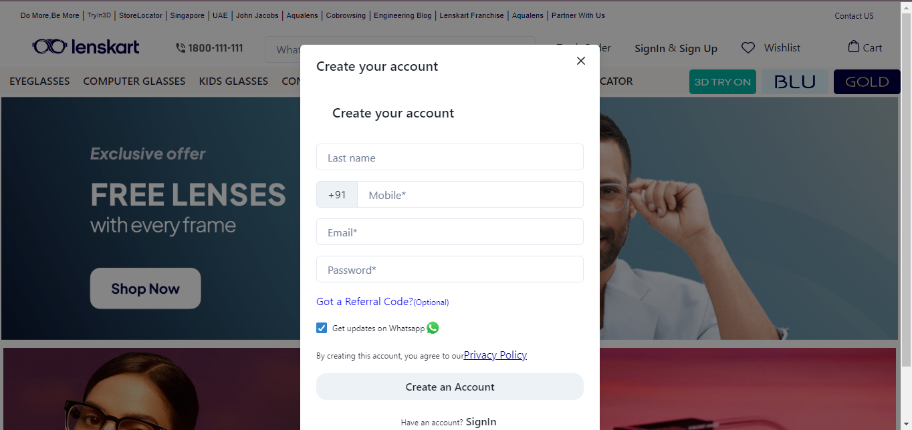

# ClearView 🛒  
_Transforming Your Eyewear Shopping Experience_  

**ClearView** is your go-to e-commerce platform inspired by Lenskart, crafted with the freshest tech like **React.js** and **Chakra UI**. This project is all about delivering a smooth, engaging, and modern online shopping experience. Whether you're hunting for the latest eyewear, sorting by your faves, or flexing your cart, **ClearView** keeps it simple and stylish. 

---

## 🌐 **Live Preview**  
[**Explore ClearView in Action**](https://clone-lens-kart.vercel.app/) 🔗

---

## 🚀 **Key Features** 

- **Dynamic Home Page 🏡**: Our home page is like your favorite playlist—packed with featured collections, epic deals, and trending products to kickstart your shopping spree.

- **Complete User Authentication 🌐**: Sign up or log in in a flash! Personalize your experience, track orders, and manage your faves with ease.

- **Advanced Product Sorting & Filters 🔄**: Sort products by price (Low to High, High to Low) and filter by frame type, size, and more to find your perfect match.

- **Integrated Search Functionality 🔍**: Find what you’re looking for in seconds with our sleek search bar—making shopping feel effortless!

- **Seamless Cart & Checkout 🛒**: Add items, review your selections, and get ready to checkout (payment integration is on the way, don’t worry!).

- **Responsive Design 📱**: Thanks to **Chakra UI**, our design adapts to your device like a chameleon—whether you’re on mobile, tablet, or desktop!

- **Efficient Routing & Navigation 🛤️**: Navigate with ease as **React Router** ensures smooth transitions between pages—no lag, just vibes.

- **Scalable State Management**: With **Context API**, we’ve got global state management on lock, making it super scalable for all your future needs!

---

## 💻 **Tech Stack** 

- **React.js**: For a dynamic and interactive frontend that makes everything pop!
- **Chakra UI**: Ensures the design is modern and responsive, so you look good on any device.
- **Vite**: This build tool is like a turbo boost for your development, providing lightning-fast builds.
- **React Router**: Keeps navigation smooth and easy-peasy.
- **Context API**: Lightweight state management for when you want to keep things chill.
- **npm**: The trusty sidekick for managing dependencies and scripts.

---

## ⚡ **Getting Started** 

To set up and run **ClearView** on your local machine, follow these steps:

1. **Clone the repository**:
   ```bash
   git clone https://github.com/KmNeetuSingh/Clone_LensKart
   ```

2. **Navigate to the project directory**:
   ```bash
   cd clearview
   ```

3. **Install all dependencies**:
   ```bash
   npm install
   ```

4. **Start the development server**:
   ```bash
   npm run dev
   ```

Now you’re all set! Open your browser and check it out at `http://localhost:3000`.

---

## 🖼️ **Screenshots**  
Here’s a sneak peek of what **ClearView** looks like:
- # HomePage ---  

- # ProductPage ---  
 
- # CartPage ---  

- # SignUp ---  


---

## 🔮 **What Makes ClearView Stand Out?** 

**ClearView** is more than just a clone—it’s a vibe! We’ve got a killer user authentication system and next-level filtering/search capabilities that make online shopping feel like a breeze. 

Each feature—from the **responsive design** to **seamless routing** and **state management**—is crafted to mimic real-world applications, offering a learning experience that goes beyond just copying an interface. **ClearView** showcases how **performance**, **scalability**, and **user experience** come together for an epic shopping adventure. 

---

## 🌟 **Future Enhancements** 

While we’re hyped about what **ClearView** can do right now, there’s always room for upgrades:

- **Payment Integration**: Coming soon! Get ready for a secure payment gateway for that full shopping experience.
- **Enhanced User Profiles**: Let’s personalize your accounts with order history and custom profiles.
- **Product Reviews & Ratings**: Users can leave their thoughts on products, making shopping even more interactive!

---

## 💡 **Learning Outcomes** 

Building **ClearView** was a total game changer! Here’s what we’ve learned:

- **Efficient State Management**: Thanks to **Context API**, we’ve mastered global state handling for smooth data flow.
- **Responsive UI Design**: Leveraging **Chakra UI** keeps our layout accessible and visually cohesive on all devices.
- **Component-Based Architecture**: With **React.js**, we’re breaking down UI into reusable, maintainable pieces—seriously, it’s the future!

---

**ClearView** isn’t just another clone; it’s a testament to how **React** and **Chakra UI** can create a fast, responsive, and feature-rich e-commerce experience. Dive into the project and discover how modern web tech is shaping the future of online shopping. ✨

---

